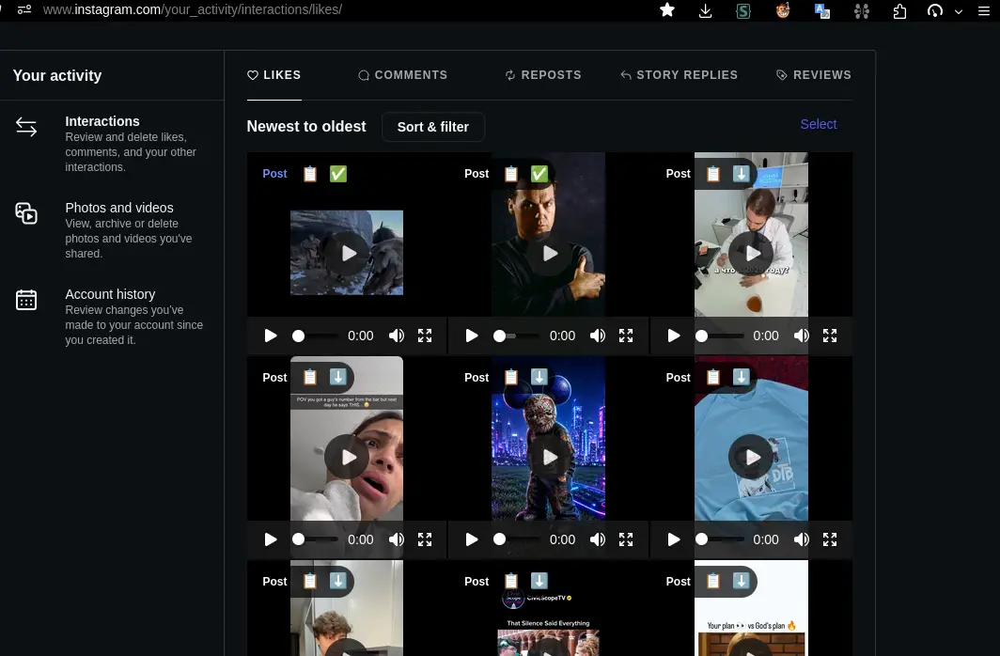

# Instagram Likes to normal videos and images - so you can preview and download

<div align='center'>
	<a href='https://raw.githubusercontent.com/vitaly-zdanevich/instagram-likes-to-normal-media/main/greasyfork/instagram-likes-media.user.js' alt='Install with a browser extension'>
		
	</a>
</div>

A small TypeScript userscript for Instagram’s **Your activity → Likes** page. It keeps Instagram’s page in place and adds:

- native, playable `<video controls>` elements for videos and Reels;
- native `` elements for carousel images;
- an ordinary **Post** link on every tile;
- a `📋` button beside each link to copy it;
- a `🔗` button that copies linked `By account, source` attribution for rich-text apps;
- a `⬇️` button that downloads a video using the post caption’s first line as its filename.



No user-supplied API key, Instagram password, backend, PWA, or like-changing automation is involved. The script uses the browser session that is already signed in to Instagram.

## Install

1. Install [Violentmonkey](https://violentmonkey.github.io/) or [Tampermonkey](https://www.tampermonkey.net/).
2. Install [Instagram Likes Media from Greasy Fork](https://greasyfork.org/en/scripts/590489-instagram-likes-media).
3. Open [Instagram’s Likes activity page](https://www.instagram.com/your_activity/interactions/likes/).

To build from source, run `npm install` and `npm run build`, then open `dist/instagram-likes-media.user.js` in the browser. The production file is a single minified userscript. Rebuild it after changing anything under `src/`.

## Development

```sh
npm run dev           # rebuild when source files change
npm run typecheck
npm run lint
npm test
npm run test:coverage
npm run build
```

Tests use mock Instagram data and jsdom; they do not access an Instagram account.

## Greasy Fork publishing

`npm run build` writes a readable, unminified bundle to `greasyfork/instagram-likes-media.user.js`. This file is tracked because Greasy Fork synchronizes from a raw repository URL; CI rejects a commit when the bundle is stale.

After the first GitHub push:

1. Import the script into Greasy Fork from `https://raw.githubusercontent.com/vitaly-zdanevich/instagram-likes-to-normal-media/main/greasyfork/instagram-likes-media.user.js`.
2. Open [Greasy Fork’s webhook setup](https://greasyfork.org/en/users/webhook-info) and generate its secret.
3. In the GitHub repository, open **Settings → Webhooks → Add webhook**.
4. Use Greasy Fork’s payload URL and secret, choose `application/json`, select **Just the push event**, and leave the webhook active.

Greasy Fork will then check the tracked bundle after each repository push. The webhook secret belongs in GitHub’s webhook settings, not in this repository or GitHub Actions.

## Compatibility and limitations

The JavaScript bundle targets Chrome/Chromium 109+ and Firefox 115+. It is tested on Linux but contains no Linux-specific code.

The script depends on Instagram’s undocumented authenticated media-info endpoint, its response format, and the Likes page’s DOM structure and thumbnail `ig_cache_key` parameter. Instagram can change any of these without notice. A warning icon on a tile contains the media-loading error in its tooltip.

Media URLs are Instagram CDN URLs and can expire. The script does not auto-scroll; it processes only likes that Instagram has rendered.

## Other userscripts

See all published scripts on [my Greasy Fork profile](https://greasyfork.org/en/users/22859-vitaly-zdanevich).

| Userscript | Greasy Fork | GitLab |
| --- | --- | --- |
| Ctrl-S for search, Alt-C to Create, F4 to Notes button (like view reset) | [Install](https://greasyfork.org/en/scripts/567689-ctrl-s-for-search-alt-c-to-create-f4-to-notes-button-like-view-reset) | [Source](https://gitlab.com/vitaly-zdanevich-userscripts/evernote/hotkey) |
| Evernote direct link opening, without "You are leaving Evernote" | [Install](https://greasyfork.org/en/scripts/489822-evernote-direct-link-opening-without-you-are-leaving-evernote) | [Source](https://gitlab.com/vitaly-zdanevich-userscripts/evernote/evernote-direct-link-opening-without-you-are-leaving) |
| moneymuseum.by: PDP: add button to copy a title without spaces | [Install](https://greasyfork.org/en/scripts/497666-moneymuseum-by-pdp-add-button-to-copy-a-title-without-spaces) | [Source](https://gitlab.com/vitaly-zdanevich-userscripts/copy-title-without-spaces) |
| moneymuseum.by: show links to uploaded files in Wikimedia Commons | [Install](https://greasyfork.org/en/scripts/497667-moneymuseum-by-show-links-to-uploaded-files-in-wikimedia-commons) | [Source](https://gitlab.com/vitaly-zdanevich-extensions/moneymuseum-by-wikimedia-commons) |
| StackExchange dark mode work-in-progress | [Install](https://greasyfork.org/en/scripts/541577-stackexchange-dark-mode-work-in-progress) | [Source](https://gitlab.com/vitaly-zdanevich-userscripts/stackexchange) |
| Wikimedia Commons category page: highlight my files (of the current user) | [Install](https://greasyfork.org/en/scripts/497761-wikimedia-commons-category-page-highlight-my-files-of-the-current-user) | [Source](https://gitlab.com/vitaly_zdanevich_wikimedia/userscripts/highlightMyFiles) |
| Wikimedia Commons: files page: add categories near every file name | [Install](https://greasyfork.org/en/scripts/497665-wikimedia-commons-files-page-add-categories-near-every-file-name) | [Source](https://gitlab.com/vitaly_zdanevich_wikimedia/userscripts/uploadPageShowCategories) |
| Wikimedia Commons upload page: click to a few radio buttons | [Install](https://greasyfork.org/en/scripts/535277-wikimedia-commons-upload-page-click-to-a-few-radio-buttons) | [Source](https://gitlab.com/vitaly_zdanevich_wikimedia/userscripts/uploadingRadioClicks) |
| Wikimedia Commons upload page: near Categories input - set previous clickable categories | [Install](https://greasyfork.org/en/scripts/497661-wikimedia-commons-upload-page-near-categories-input-set-previous-clickable-categories) | [Source](https://gitlab.com/vitaly_zdanevich_wikimedia/userscripts/uploadSetPrevCategories) |
| Wikipedia: hotkey: Edit: remap Alt-Shift-V to Alt-Shift-A | [Install](https://greasyfork.org/en/scripts/566084-wikipedia-hotkey-edit-remap-alt-shift-v-to-alt-shift-a) | [Source](https://gitlab.com/vitaly-zdanevich-userscripts/wikipediaEditHotkey) |
| Wikipedia: languages list to the bottom of a page | [Install](https://greasyfork.org/en/scripts/566105-wikipedia-languages-list-to-the-bottom-of-a-page) | [Source](https://gitlab.com/vitaly-zdanevich-userscripts/wikipediaLanguagesToTheBottom) |
| YandexMail: faster link opening - without intermediate Yandex page | [Install](https://greasyfork.org/en/scripts/498413-yandexmail-faster-link-opening-without-intermediate-yandex-page) | [Source](https://gitlab.com/vitaly-zdanevich-userscripts/mail-yandex-ru-link-click-drop-intermediate-yandex-redirect) |

## Related documentation

- [Violentmonkey metadata block](https://violentmonkey.github.io/api/metadata-block/)
- [Violentmonkey privileged APIs](https://violentmonkey.github.io/api/gm/)
- [Tampermonkey documentation](https://www.tampermonkey.net/documentation.php)
- [Greasy Fork API and webhook notifications](https://greasyfork.org/en/help/api)
- [Greasy Fork code rules](https://greasyfork.org/en/help/code-rules)
- [esbuild API](https://esbuild.github.io/api/)
- [Node.js test runner](https://nodejs.org/api/test.html)
